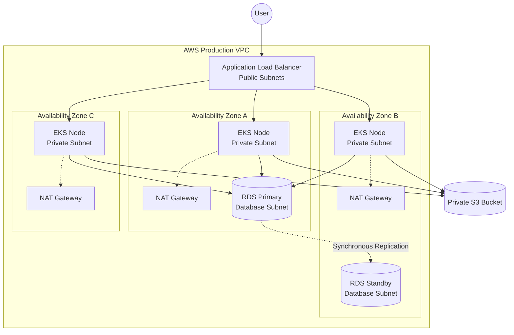

# ☁️ Enterprise AWS Multi-Environment Infrastructure

This repository contains a highly available, secure, and cost-optimized multi-environment AWS infrastructure built using Terraform. 

## 🏗️ Architecture Overview

The infrastructure strictly isolates environments (`dev`, `staging`, `prod`) to guarantee zero cross-contamination. Every environment provisions a completely independent network (VPC), compute layer (EKS), database (RDS), and storage system (S3 & ECR).

### 🌐 System Architecture Diagram



### 📁 Repository Structure

```text
aws-infrastructure/
└── terraform/
    ├── global/                     # "Chicken-and-egg" Terraform state management
    │   ├── dev-backend/            # Strictly isolated S3/DynamoDB for Dev
    │   ├── staging-backend/        # Strictly isolated S3/DynamoDB for Staging
    │   └── prod-backend/           # Strictly isolated S3/DynamoDB for Prod
    ├── modules/                    # Reusable, secure infrastructure blueprints
    │   ├── vpc/                    # Multi-AZ networking
    │   ├── iam/                    # Least-privilege roles
    │   ├── eks/                    # Kubernetes with Spot & Graviton support
    │   ├── ecr/                    # Container Registry for Docker images
    │   ├── rds/                    # Multi-AZ capable database
    │   └── s3/                     # Encrypted, versioned storage
    └── environments/               # Environment-specific deployments
        ├── dev/                    # Cost-optimized testing environment
        └── prod/                   # Highly available, enterprise-grade environment
```

## 💰 FinOps & Cost Optimization (`dev`)
Non-production environments are aggressively optimized to reduce the AWS bill:
- **Spot Instances:** EKS worker nodes utilize AWS Spot capacity (`eks_use_spot_instances = true`) for major compute savings.
- **Single NAT Gateway:** Instead of provisioning a NAT Gateway per Availability Zone, Dev uses a single shared gateway to minimize hourly costs.
- **S3 Data Lifecycle:** Automated rules instantly transition older S3 objects to `STANDARD_IA` and expire them completely after 30 days.

## 🛡️ Security & High Availability (`prod`)
Production is built for enterprise resilience and strict security:
- **100% State Isolation:** Every environment uses a completely isolated S3 Bucket and DynamoDB table for Terraform state.
- **Multi-AZ Failover:** RDS is configured with a synchronous standby replica in a secondary Availability Zone. If an AZ goes down, failover is automatic.
- **Immutable Container Tags:** ECR forces `IMMUTABLE` tags, ensuring that a tested Docker image (e.g., `v1.2`) can never be silently overwritten by a bad build.
- **EKS Node Distribution:** EKS Managed Node Groups automatically balance compute instances across three distinct Availability Zones.

## 🚀 How to Deploy

### 1. Bootstrap the State Backends
These directories must be applied first using local state to create the strictly isolated S3 buckets and DynamoDB tables.
1. Navigate to `terraform/global/dev-backend`
2. Run `terraform init` and `terraform apply`
3. *Note the generated bucket name from the output.*
4. Repeat this process for `staging-backend` and `prod-backend`.

### 2. Configure the Environments
1. Open `terraform/environments/dev/backend.tf` and update `REPLACE_WITH_ID` with the actual bucket name generated for dev from step 1.
2. Ensure you have the correct variables set in `terraform/environments/dev/terraform.tfvars`.

### 3. Deploy the Infrastructure
1. Navigate to `terraform/environments/dev`
2. Run `terraform init` (this securely connects to your isolated S3 bucket).
3. Run `terraform plan` to preview the infrastructure.
4. Run `terraform apply` to provision the environment!
